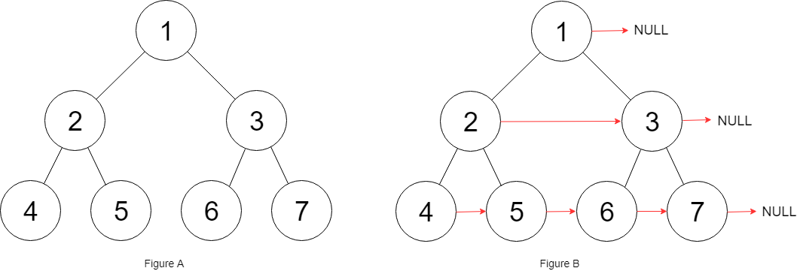

# 116. Populating Next Right Pointers in Each Node

https://leetcode.com/problems/populating-next-right-pointers-in-each-node/

## Description

You are given a **perfect binary tree** where all leaves are on the same level, and every parent has two children. The binary tree has the following definition:

    struct Node {
        int val;
        Node *left;
        Node *right;
        Node *next;
    }

Populate each next pointer to point to its next right node. If there is no next right node, the next pointer should be set to __NULL__.

Initially, all next pointers are set to __NULL__.

## Example 1:

    Input: root = [1,2,3,4,5,6,7]
    Output: [1,#,2,3,#,4,5,6,7,#]
    Explanation: Given the above perfect binary tree (Figure A), your function should populate each next pointer to point to its next right node, just like in Figure B. The serialized output is in level order as connected by the next pointers, with '#' signifying the end of each level.

## Example 2:

    Input: root = []
    Output: []

## Constraints:

- The number of nodes in both trees is in the range [0, 2000].
- -104 <= Node.val <= 104