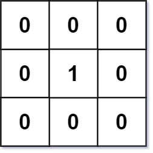
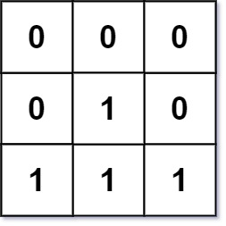

# 542. 01 Matrix

https://leetcode.com/problems/01-matrix/

## Description

Given an __m x n__ binary matrix __mat__, return the distance of the nearest __0__ for each cell.

The distance between two adjacent cells is __1__.

## Example 1:

    Input: mat = [[0,0,0],[0,1,0],[0,0,0]]
    Output: [[0,0,0],[0,1,0],[0,0,0]]

## Example 2:

    Input: mat = [[0,0,0],[0,1,0],[1,1,1]]
    Output: [[0,0,0],[0,1,0],[1,2,1]]

## Constraints:

- m == mat.length 
- n == mat[i].length 
- 1 <= __m__, __n__ <= 104 
- 1 <= __m * n__ <= 10sup>4
- __mat[i][j]__ is either __0__ or __1__
- There is at least one __0__ in __mat__