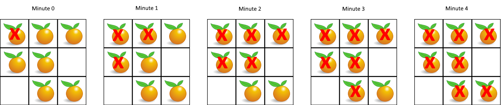

# 994. Rotting Oranges

https://leetcode.com/problems/rotting-oranges/

## Description

You are given an __m x n__ __grid__ where each cell can have one of three values:

- __0__ representing an empty cell,
- __1__ representing a fresh orange, or
- __2__ representing a rotten orange.

Every minute, any fresh orange that is **4-directionally adjacent** to a rotten orange becomes rotten.

Return the minimum number of minutes that must elapse until no cell has a fresh orange. If this is impossible, return __-1__.

## Example 1:

    Input: grid = [[2,1,1],[1,1,0],[0,1,1]]
    Output: 4

## Example 2:

    Input: grid = [[2,1,1],[0,1,1],[1,0,1]]
    Output: -1
    Explanation: The orange in the bottom left corner (row 2, column 0) is never rotten, because rotting only happens 4-directionally.

## Example 3:

    Input: grid = [[0,2]]
    Output: 0
    Explanation: Since there are already no fresh oranges at minute 0, the answer is just 0.

## Constraints:

- __m__ == grid.length 
- __n__ == grid[i].length 
- 1 <= __m__, __n__ <= 10 
- grid[i][j] is __0__, __1__, or __2__