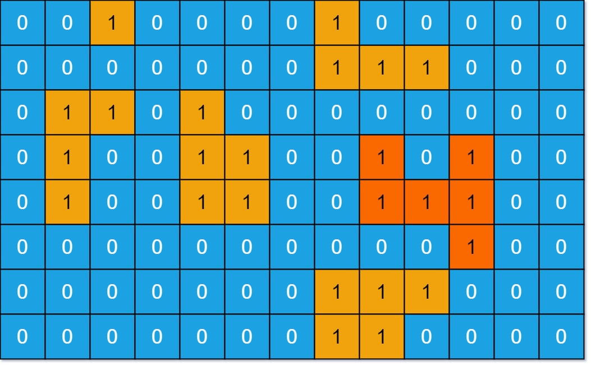

# 695. Max Area of Island

https://leetcode.com/problems/max-area-of-island/

## Description

You are given an __m x n__ binary matrix __grid__. An island is a group of __1__'s (representing land) connected **4-directionally** (horizontal or vertical.) You may assume all four edges of the grid are surrounded by water.

The area of an island is the number of cells with a value __1__ in the island.

Return the maximum area of an island in __grid__. If there is no island, return __0__.

## Example 1:

    Input: grid = [[0,0,1,0,0,0,0,1,0,0,0,0,0],[0,0,0,0,0,0,0,1,1,1,0,0,0],[0,1,1,0,1,0,0,0,0,0,0,0,0],[0,1,0,0,1,1,0,0,1,0,1,0,0],[0,1,0,0,1,1,0,0,1,1,1,0,0],[0,0,0,0,0,0,0,0,0,0,1,0,0],[0,0,0,0,0,0,0,1,1,1,0,0,0],[0,0,0,0,0,0,0,1,1,0,0,0,0]]
    Output: 6
    Explanation: The answer is not 11, because the island must be connected 4-directionally.

## Example 2:

    Input: grid = [[0,0,0,0,0,0,0,0]]
    Output: 0

## Constraints:

- __m__ == grid.length 
- __n__ == grid[i].length 
- 1 <= __m__, __n__ <= 50 
- __grid[i][j]__ is either 0 or 1.