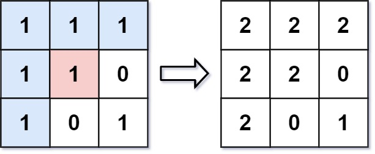

# 733. Flood Fill

https://leetcode.com/problems/flood-fill/

## Description

An image is represented by an __m x n__ integer grid __image__ where __image[i][j]__ represents the pixel value of the image.

You are also given three integers __sr__, __sc__, and __color__. You should perform a flood fill on the image starting from the pixel __image[sr][sc]__.

To perform a flood fill, consider the starting pixel, plus any pixels connected 4-directionally to the starting pixel of the same color as the starting pixel, plus any pixels connected 4-directionally to those pixels (also with the same color), and so on. Replace the color of all of the aforementioned pixels with __color__.

Return the modified image after performing the flood fill.

## Example 1:

    Input: image = [[1,1,1],[1,1,0],[1,0,1]], sr = 1, sc = 1, color = 2
    Output: [[2,2,2],[2,2,0],[2,0,1]]
    Explanation: From the center of the image with position (sr, sc) = (1, 1) (i.e., the red pixel), all pixels connected by a path of the same color as the starting pixel (i.e., the blue pixels) are colored with the new color.
    Note the bottom corner is not colored 2, because it is not 4-directionally connected to the starting pixel.

## Example 2:

    Input: image = [[0,0,0],[0,0,0]], sr = 0, sc = 0, color = 0
    Output: [[0,0,0],[0,0,0]]
    Explanation: The starting pixel is already colored 0, so no changes are made to the image.

## Constraints:

- __m__ == image.length
- __n__ == image[i].length 
- 1 <= __m__, __n__ <= 50 
- 0 <= __image[i][j]__, __color__ < 216 
- 0 <= __sr__ < __m__ 
- 0 <= __sc__ < __n__