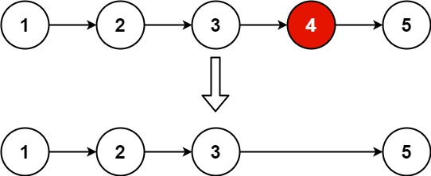

# 19. Remove Nth Node From End of List

https://leetcode.com/problems/remove-nth-node-from-end-of-list/

## Description

Given the __head__ of a linked list, remove the __nth__ node from the end of the list and return its head.

## Example 1:

    Input: head = [1,2,3,4,5], n = 2
    Output: [1,2,3,5]

## Example 2:

    Input: head = [1], n = 1
    Output: []

## Example 3:

    Input: head = [1,2], n = 1
    Output: [1]

## Constraints:

- The number of nodes in the list is __sz__
- 1 <= __sz__ <= 30
- 0 <= Node.val <= 100
- 1 <= __n__ <= __sz__